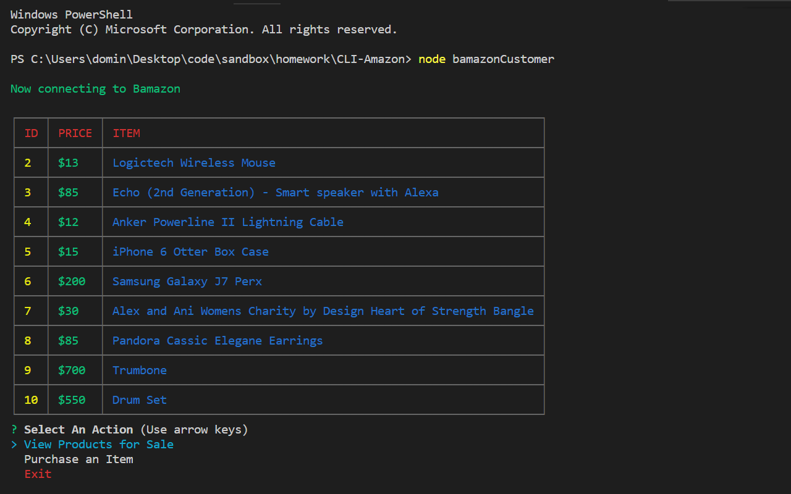

# CLI-Amazon

<i><b>CLI Amazon</b></i> is a command-line application based on amazon's functionality. This tool is uses a MySql and Node Js in order to make purchases, add products, restock inventory, and track sales.

## Getting Started

These instructions will get you a copy of the project up and running on your local machine for development and testing purposes.

### Prerequisites

* CMD Terminal
* GitBash(Optional)
* Node Js
* MySql Workbench

### Installing

Download the zipped file from the GitHub repository by clicking the link below. When the page is loaded, click on the "clone or download" button. 
At the botom of the drop down click the "Download Zip" button. 

[GitHub](https://github.com/CodingDom/Liri-Bot) - link to GitHub repo

Open up the "CLI-Amazon" file in a command terminal. 

Use "npm install" to install all required dependencies for the app.

```
npm install
```
Use "node bamazonCustomer.js" to test the customer's perpespective of the application. Use the same command on the other files such as bamazonManager.js and bamazonSupervisor.js to test the application from higher levels of authority.

```
node bamazonCustomer.js
```

## Preview

### Customer


### Manager


### Supervisor
